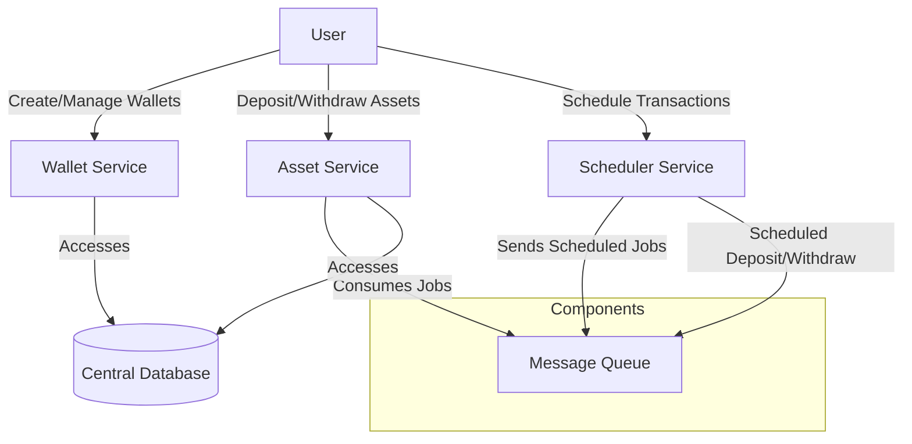

# Project Brief

> **Project: Asset Management Service Objective**
> 
> You are required to build a small microservice-based system for managing wallets and their assets. There should be at least 2 services, but you can split these services further as you see fit.
> 
> **Requirements**
> 
> 1- Wallet Management Service: Responsible for creating, retrieving, and deleting wallets.
> Each wallet will have an address and network, and these two fields combined should be unique.
> 
> 2- Asset Management Service: Handles asset operations for existing wallets, including withdrawals, deposits, and scheduled transactions.
> It should allow withdraw and deposit operations.
> 
> It should also include a feature that allows users to schedule transactions, enabling them to send assets from one wallet to another at a specified future time.
> 
> **Example**
> 
> Wallet: 
> ```json
> {"address": "1Lbcfr7sAHTD9CgdQo3HTMTkV8LK4ZnX71", "network": "Bitcoin"}
> ```
> 
> Asset: 
> ```json
> {"name": "BTC", "amount": 10}
> ```
> **Implementation Details**
> 
> **Database:** You are free to choose any database for data storage.
> 
> **User Management:** Not required, but you may implement it if desired.
> 
> **Documentation:** Provide comprehensive documentation to set up and run the project.
> 
> **Additional Tools:** Include Docker, tests, and/or automated scripts to facilitate evaluation.
> 
> **Creativity and Questions**
> 
> We intentionally left some details unspecified to encourage creativity in your approach.


### System Architecture Diagram




- TODO
- transaction-outbox-publisher (outbox)
- big decimal (numeric 30,10)
- test (testcontainer, unit, integration(mock, controller test), e2e(testcontainer, wiremock))