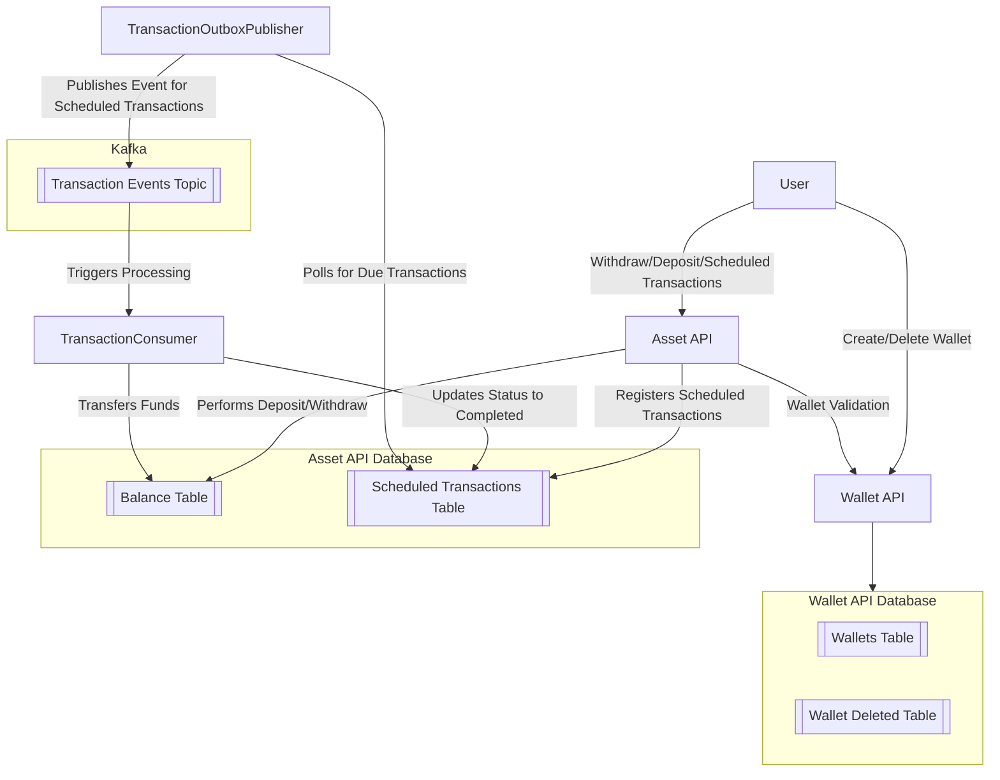

> **Project: Asset Management Service Objective**
> 
> You are required to build a small microservice-based system for managing wallets and their assets. There should be at least 2 services, but you can split these services further as you see fit.
> 
> **Requirements**
> 
> 1- Wallet Management Service: Responsible for creating, retrieving, and deleting wallets.
> Each wallet will have an address and network, and these two fields combined should be unique.
> 
> 2- Asset Management Service: Handles asset operations for existing wallets, including withdrawals, deposits, and scheduled transactions.
> It should allow withdraw and deposit operations.
> 
> It should also include a feature that allows users to schedule transactions, enabling them to send assets from one wallet to another at a specified future time.
> 
> **Example**
> 
> Wallet: 
> ```json
> {"address": "1Lbcfr7sAHTD9CgdQo3HTMTkV8LK4ZnX71", "network": "Bitcoin"}
> ```
> 
> Asset: 
> ```json
> {"name": "BTC", "amount": 10}
> ```
> **Implementation Details**
> 
> **Database:** You are free to choose any database for data storage.
> 
> **User Management:** Not required, but you may implement it if desired.
> 
> **Documentation:** Provide comprehensive documentation to set up and run the project.
> 
> **Additional Tools:** Include Docker, tests, and/or automated scripts to facilitate evaluation.
> 
> **Creativity and Questions**
> 
> We intentionally left some details unspecified to encourage creativity in your approach.


# System Architecture Diagram




1. **Wallet Management Service (wallet-api):**
    - Creates, retrieves, and deletes wallets.
    - Each wallet has a unique combination of address and network, stored in the `wallets` table.
    - Deleted wallets are moved to the `wallet_deleteds` table for record-keeping.

2. **Asset Management Service (asset-api):**
    - Performs withdrawal and deposit operations, updating the `balance` table.
    - Supports scheduling transactions, enabling users to transfer assets from one wallet to another at a specified future time, recorded in the `scheduled_transactions` table.

3. **Transaction Outbox Publisher:**
    - Regularly polls the `scheduled_transactions` table for transactions scheduled to be executed.
    - Publishes events for due transactions to a Kafka topic, triggering the transaction processing workflow.

4. **Transaction Consumer:**
    - Listens to the Kafka topic for transaction events.
    - Processes each event by transferring funds in the `balance` table and updating the transaction status from "PENDING" to "COMPLETED" in the `scheduled_transactions` table.


```
asset-management
├── internal
├── pkg
├── services
│   ├── asset-api
│   │   ├── main.go
│   │   └── Dockerfile
│   ├── transaction-consumer
│   │   ├── main.go
│   │   └── Dockerfile
│   ├── transaction-outbox-publisher
│   │   ├── main.go
│   │   └── Dockerfile
│   └── wallet-api
│       ├── main.go
│       └── Dockerfile
├── Makefile
└── docker-compose.yml
```


> Each microservice has its entry point defined by `main.go`, with a `Dockerfile` located alongside each entry point to containerize the service. The `docker-compose.yml` file orchestrates these Docker images, enabling the microservices to work together seamlessly. Additionally, the `Makefile` is provided to simplify this orchestration, making it easier to manage and run the entire setup.


## Database Table Entry Examples

> **Note:** In this schema, `network` is used in place of `name` to represent the network associated with each wallet or transaction.

- Balance:
```json
{
    "wallet_address": "1Lbcfr7sAHTD9CgdQo3HTMTkV8LK4ZnX71",
    "network": "Bitcoin",
    "balance": 100.00
}
```

- Scheduled Transaction:
```json
{
    "scheduled_transaction_id": 1,
    "from_wallet_address": "1Lbcfr7sAHTD9CgdQo3HTMTkV8LK4ZnX71",
    "to_wallet_address": "1Kzo9sXeUWo12nkXnKL4WECF5DRDojps6Y",
    "network": "Bitcoin",
    "amount": 50.00,
    "scheduled_time": "2024-10-31T12:00:00Z",
    "status": "PENDING",
    "created_at": "2024-10-30T08:00:00Z"
}
```

- Wallet:

```json
{
    "id": 1,
    "network": "Bitcoin",
    "address": "1Lbcfr7sAHTD9CgdQo3HTMTkV8LK4ZnX71"
}
```

- Wallet Deleted:
```json
{
    "id": 1,
    "network": "Bitcoin",
    "address": "1Lbcfr7sAHTD9CgdQo3HTMTkV8LK4ZnX71"
}
```

# Project Setup

This project includes several microservices managed with Docker Compose. Follow the steps below to set up and run the project locally.

## Prerequisites

- **Docker**: Ensure you have Docker installed on your system.
- **Docker Compose**: Confirm Docker Compose is installed, as it’s used to orchestrate the containers.

## Services Overview

The project consists of the following services:

1. **Zookeeper**: Manages configuration and synchronization for Kafka.
2. **Kafka**: Provides messaging functionality, including a test topic for communication.
3. **Kafka UI**: A UI for monitoring Kafka topics and messages.
4. **Asset API**: Manages asset operations and interacts with the `wallet-api` for validation.
5. **Wallet API**: Manages wallet creation and deletion.
6. **Transaction Consumer**: Listens to Kafka topics, processes transactions, and updates balances.
7. **Transaction Outbox Publisher**: Periodically publishes events to Kafka based on a configured schedule.
8. **Databases**:
   - `wallet-db`: PostgreSQL database for wallet information.
   - `asset-db`: PostgreSQL database for asset data.

## Setup and Run

1. **Start Services**: Run the following command to start all services in the background.

   ```bash
   make up
   ```

2. **Stop Services**: To stop all services, use:

   ```bash
   make down
   ```

3. **Restart Services**: If you need to restart all services:

   ```bash
   make restart
   ```

4. **Build Services**: To build the images without starting the containers:

   ```bash
   make build
   ```

5. **View Logs**: To monitor logs for all services, run:

   ```bash
   make logs
   ```

6. **View Logs for a Specific Service**: To monitor logs for individual services, run the following commands:

   1. **Zookeeper**: To view logs for the Zookeeper service, run:

       ```bash
       make logs | grep zookeeper
       ```

   2. **Kafka Broker (kafka1)**: To view logs for the Kafka broker (kafka1), run:

       ```bash
       make logs | grep kafka1
       ```

   3. **Kafka UI**: To view logs for the Kafka UI service, run:

       ```bash
       make logs | grep kafka-ui
       ```

   4. **Asset API**: To view logs for the Asset API service, run:

       ```bash
       make logs | grep asset-api
       ```

   5. **Wallet API**: To view logs for the Wallet API service, run:

       ```bash
       make logs | grep wallet-api
       ```

   6. **Transaction Consumer**: To view logs for the Transaction Consumer service, run:

       ```bash
       make logs | grep transaction-consumer
       ```

   7. **Transaction Outbox Publisher**: To view logs for the Transaction Outbox Publisher service, run:

       ```bash
       make logs | grep transaction-outbox-publisher
       ```

   8. **Wallet Database (PostgreSQL)**: To view logs for the Wallet Database service, run:

       ```bash
       make logs | grep wallet-db
       ```

   9. **Asset Database (PostgreSQL)**: To view logs for the Asset Database service, run:

       ```bash
       make logs | grep asset-db
       ```

7. **Rebuild Services**: For a fresh build and restart, use:

   ```bash
   make rebuild
   ```

8. **Clean Up**: To remove all volumes and orphaned containers, use:

   ```bash
   make delete
   ```

## Accessing Services

- **[Kafka UI](http://localhost:8080)**: Access the Kafka UI.
- **[Asset API](http://localhost:8001)**: Accessible on `http://localhost:8001`.
- **[Wallet API](http://localhost:8000)**: Accessible on `http://localhost:8000`.
- **[Transaction Outbox Publisher](http://localhost:8002)**: Accessible on `http://localhost:8002`.


- [ ] Endpoints
