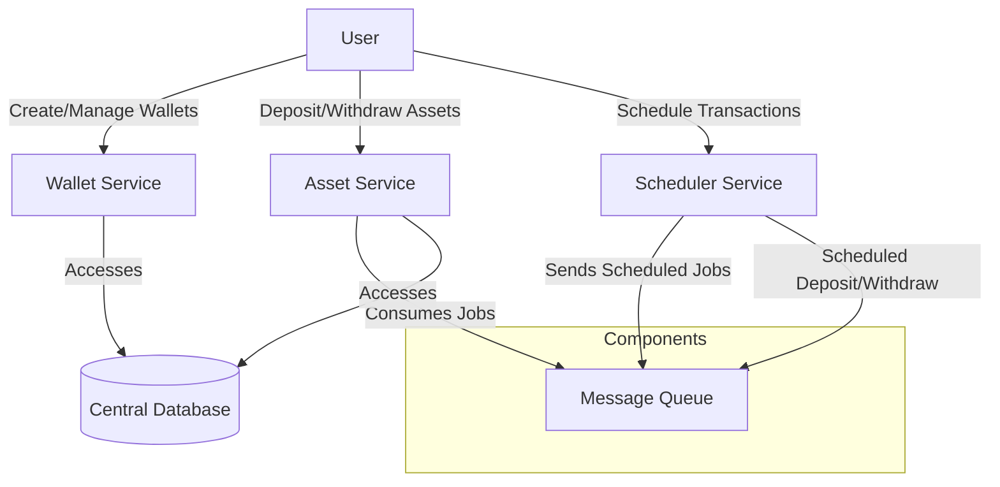

# asset-management
### System Architecture Diagram

### System Architecture Diagram

```mermaid
graph TD
    %% Services
    User -->|Create/Manage Wallets| WalletService[Wallet Service]
    User -->|Deposit/Withdraw Assets| AssetService[Asset Service]
    User -->|Schedule Transactions| SchedulerService[Scheduler Service]
    
    SchedulerService -->|Sends Scheduled Jobs| MessageQueue[Message Queue]
    AssetService -->|Consumes Jobs| MessageQueue

    %% Database Connection
    WalletService -->|Accesses| Database[(Central Database)]
    AssetService -->|Accesses| Database

    %% Components
    subgraph Components
        MessageQueue
    end

    %% Scheduler-Asset Interaction
    SchedulerService -->|Scheduled Deposit/Withdraw| MessageQueue
```
